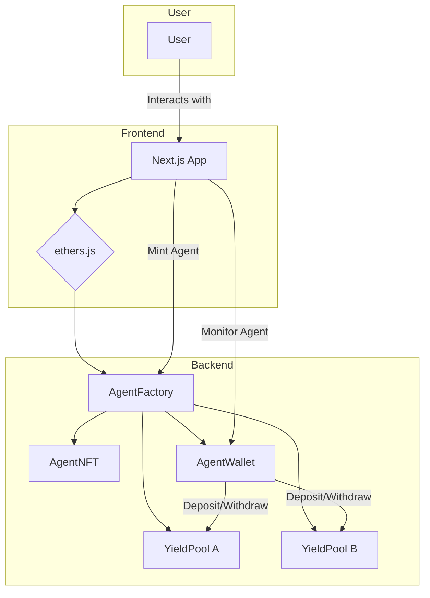

# Somnia AI Agent

## Inspiration

The Somnia AI Hackathon's vision of a world powered by autonomous on-chain agents inspired us to create an intelligent DeFi agent capable of navigating the complex world of yield farming. We believe that by democratizing access to sophisticated financial strategies, we can empower users and create a more efficient and equitable financial system.

## What it does

Our project introduces a sophisticated DeFi agent that automates yield farming strategies. Users can mint an agent, which then autonomously manages their assets to maximize returns. The agent intelligently switches between different yield pools based on which one is offering the highest returns, ensuring optimal performance at all times. This hands-free approach to yield farming allows users to benefit from complex DeFi strategies without needing to constantly monitor and manage their positions.

Key Features:

*   **Autonomous Yield Farming:** The agent automatically seeks out and invests in the highest-yielding pools.
*   **Dynamic Strategy Switching:** The agent can dynamically switch between different investment pools to maximize returns.
*   **User-Friendly Dashboard:** A clean and intuitive interface for minting, monitoring, and managing your AI agent.
*   **Secure and On-Chain:** All operations are executed securely on the Somnia blockchain, ensuring transparency and trust.

## How we built it

Our project is built on a robust and scalable architecture, leveraging the power of the Somnia blockchain and modern web technologies.

### Architecture Diagram

### Tech Stack

*   **Frontend:** Next.js, TypeScript, ethers.js, ShadCN
*   **Backend:** Solidity, Hardhat, OpenZeppelin
*   **Blockchain:** Somnia Testnet

## Challenges we ran into

One of the biggest challenges we faced was designing and implementing the logic for the agent's autonomous decision-making process. Ensuring that the agent could accurately assess the yields of different pools and make the optimal decision required careful planning and rigorous testing. We also spent a significant amount of time developing a secure and gas-efficient system for managing the agent's assets.

## Accomplishments that we're proud of

We are incredibly proud of creating a fully autonomous DeFi agent that can intelligently manage assets and optimize for yield. The seamless integration between the frontend and the smart contracts, which provides a smooth and intuitive user experience, is another accomplishment we are particularly proud of.

## What we learned

This hackathon has been a tremendous learning experience for our team. We have gained a much deeper understanding of the Somnia blockchain, autonomous on-chain agents, and the intricacies of developing sophisticated DeFi protocols. We have also honed our skills in smart contract development, frontend design, and system architecture.

## What's next for Somnia AI Agent

We believe that our project has the potential to revolutionize the way people interact with DeFi. In the future, we plan to:

*   **Integrate more DeFi protocols:** Allow the agent to interact with a wider range of DeFi protocols, such as lending platforms and decentralized exchanges.
*   **Enhance the agent's intelligence:** Implement more advanced machine learning algorithms to further optimize the agent's decision-making process.
*   **Introduce governance:** Allow the community to participate in the governance of the protocol and vote on new features and integrations.

## Smart Contract Addresses

*   **DemoUSD Address:** `0x631Bf62BfF979205Eee2F73D3d63c5F495Ae67De`
*   **AgentNFT Address:** `0x95f356B5078afa297b09CDA22B083D639d740cF3`
*   **YieldPool A Address:** `0xf05c8013B0c4A473C4cccA9417458251dC525b8b`
*   **YieldPool B Address:** `0xA63b9F30a09E475b31fa121e738A49F6869A278E`
*   **AgentFactory Address:** `0xAb17b786eB7Ea92619Ac5E460e1270D58d810a75`
