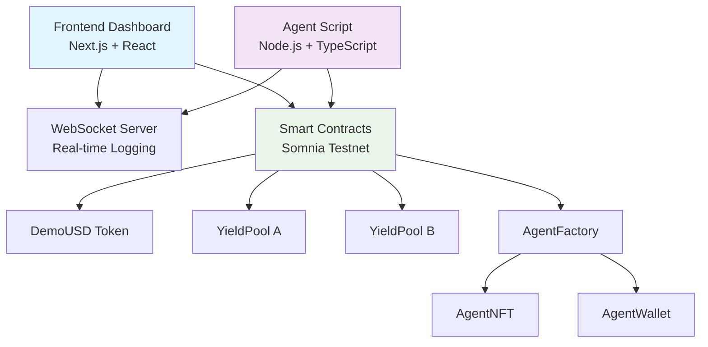

# YieldPay
> An autonomous on-chain agent for intelligent yield farming in the Somnia ecosystem.

This project is a proof-of-concept for an autonomous yield agent built for the Somnia AI Hackathon. It demonstrates how an off-chain AI/bot can manage on-chain assets, automatically moving funds between different yield pools to maximize returns for the user.

## Table of Contents

- [Architecture](#architecture)
- [Contract Addresses](#contract-addresses)
- [How It Works](#how-it-works)
- [Key Features](#key-features)
- [Tech Stack](#tech-stack)
- [Getting Started](#getting-started)
- [Contributing](#contributing)
- [License](#license)

## Architecture

The system architecture consists of interconnected components working together to enable autonomous yield farming:



- **Frontend Dashboard:** User interface for deploying agents and monitoring performance.
- **Agent Script:** Off-chain logic that monitors pools and executes transactions.
- **Smart Contracts:** On-chain components handling assets, yields, and agent management.
- **WebSocket Server:** Enables real-time communication between components.

## Contract Addresses

The following contracts are deployed on the Somnia testnet:

| Contract | Address |
|----------|---------|
| DemoUSD | `0x631Bf62BfF979205Eee2F73D3d63c5F495Ae67De` |
| AgentNFT | `0x95f356B5078afa297b09CDA22B083D639d740cF3` |
| YieldPool A | `0xf05c8013B0c4A473C4cccA9417458251dC525b8b` |
| YieldPool B | `0xA63b9F30a09E475b31fa121e738A49F6869A278E` |
| AgentFactory | `0xAb17b786eB7Ea92619Ac5E460e1270D58d810a75` |

## How It Works

The system consists of three main parts:

1. **Smart Contracts:** Deployed on the Somnia testnet, these contracts form the on-chain world. This includes the `DemoUSD` token, two `YieldPool` contracts with variable reward rates, and the `AgentFactory`. When a user deploys an agent, the factory mints an `AgentNFT` (representing ownership) and creates a dedicated `AgentWallet` for the agent to operate from.

2. **The Agent (`agent.ts`):** A Node.js script that acts as the agent's "brain". It runs off-chain, monitors the reward rates of the yield pools, and when it detects a more profitable opportunity, it automatically executes transactions to move the user's funds. It uses a designated "operator" wallet to sign these transactions.

3. **The Frontend Dashboard:** A Next.js application that provides a user-friendly interface to interact with the system. Users can connect their wallet, deploy new agents, and monitor their agent's status and balances in real-time. It also features a live log stream from the agent, showing its decision-making process as it happens.

## Key Features

- **Autonomous Yield Farming:** The agent automatically moves funds to the pool with the highest APY.
- **NFT-Based Ownership:** Each deployed agent is represented by an ERC721 NFT, giving the user true ownership.
- **Real-Time Logging:** A WebSocket connection streams the agent's actions and thoughts directly to the web dashboard.
- **Responsive UI:** A modern and responsive interface built with shadcn/ui, including a dark mode theme.
- **Interactive Demo Controls:** An admin panel allows for manual adjustment of pool APYs to demonstrate the agent's reaction in real-time.

## Tech Stack

- **Smart Contracts:** Solidity, Foundry
- **Frontend:** Next.js, React, TypeScript, Tailwind CSS, shadcn/ui
- **Blockchain Interaction:** RainbowKit, wagmi, viem
- **Agent & Logging:** Node.js, TypeScript, WebSockets (`ws`)

## Getting Started

Follow these steps to run the full application locally.

### Prerequisites

- Node.js and npm
- `ts-node` installed globally (`npm install -g ts-node`)
- A MetaMask (or similar) wallet with a temporary account for the Somnia Testnet.

### Installation

1. Clone the repository.
2. Install frontend dependencies:
   ```bash
   cd frontend
   npm install
   ```

### Running the Application

You will need to run three processes in separate terminals from the project root directory.

**1. Start the Log Server:**

```bash
node frontend/socket-server.js
```

**2. Start the Agent Script:**

*Get a private key from a new, temporary testnet account in MetaMask. See the in-app guide for more details.*

```bash
export OPERATOR_PRIVATE_KEY='0xYOUR_PRIVATE_KEY_HERE'
ts-node frontend/lib/agent.ts
```

**3. Start the Frontend Application:**

```bash
cd frontend
npm run dev
```

Once all three are running, open your browser to `http://localhost:3000` to view the dashboard.

## Contributing

Contributions are welcome! Please feel free to submit a Pull Request.